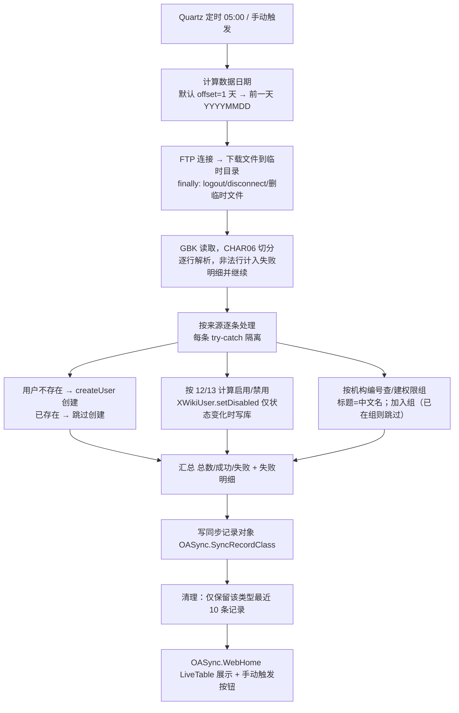

# OA 用户数据定时同步设计（行员 + 业务外包）

> 2026-08-06 | 状态：设计已确认，待评审

## 1. 需求概述

每天早上（默认 05:00，可配置）从公司 FTP 拉取「前一天」的 OA 用户数据文件，全量同步 XWiki 用户与权限组：

- **行员数据**：`/comm/bdpp/oa/YYYYMMDD/IOA_EMPLOYEE_JGTY_YYYYMMDD.dat`（GBK 编码，字段分隔符 CHAR(06) = ASCII 0x06）
- **业务外包用户数据**：文件格式未定，只保留代码入口（SPI），不写死逻辑

需求要点：

1. OA 每天凌晨 3 点多放「前一天」数据，所以 6 号同步 5 号数据（默认 offset = 1 天）
2. 单用户处理失败不影响后续用户
3. 每天全量同步，幂等
4. 页面可查看同步记录、成功/失败状态、失败日志；支持手动触发
5. 资源（FTP 连接、流、临时文件）必须可靠关闭，防内存泄漏
6. 独立新增一个代码模块

## 2. 数据映射（行员文件）

字段以 1 为起始序号，行内用 CHAR(06) 分隔，行与行之间是普通换行符，无表头行。

| 序号 | 含义 | 处理逻辑 |
|------|------|----------|
| 2 | 员工工号 | = XWiki 用户名（XWiki 不需要名/姓） |
| 11 | 账号类型代码 | **只处理 = 1 的行** |
| 12 | 员工状态代码 | 1/10/101/102/103 = 在职；2/3/4 = 离职 → 禁用 |
| 13 | 账号状态代码 | 0 = 禁用 → 禁用用户；1 = 启用 → 按序号 12 决定 |
| 23 | 归属机构编号 | 权限组唯一键（一串数字字符串） |
| 24 | 归属机构中文名 | 权限组显示名 |

**启用/禁用判定（已与需求方确认）**：

```
仅处理 序号11 == 1 的行
若 序号13 == 0          → 禁用用户
若 序号13 == 1          → 按序号12判定：
   序号12 ∈ {1,10,101,102,103} → 启用（在职）
   序号12 ∈ {2,3,4}            → 禁用（离职）
```

**用户不存在于文件**：不处理（不创建、不禁用、不动权限组）。

**用户已存在**：更新其状态（启用/禁用）、权限组归属（按机构编号），即「存在即更新」。

## 3. 模块结构（独立新增模块）

遵循仓库 `xwiki-platform-<feature>(-api/-default/-ui)` 约定：

```
xwiki-platform-core/xwiki-platform-oa-sync/
├── pom.xml                                    # packaging=pom，parent = xwiki-platform-core
├── xwiki-platform-oa-sync-api/                # jar：接口/模型
├── xwiki-platform-oa-sync-default/            # jar：实现（FTP、解析、同步、Job、REST、记录类）
└── xwiki-platform-oa-sync-ui/                 # xar：记录页、手动触发、定时任务文档
```

- 注册进 `xwiki-platform-core/pom.xml` 的 `<modules>`
- JAR 加入 distribution WAR 依赖（部署时进入 `WEB-INF/lib`），XAR 通过扩展管理器导入（或按现有部署方式拷入）
- 组件注册：新增的每个组件类必须写入各自模块的 `META-INF/services/components.txt`

## 4. 核心流程



**幂等性**：

- 创建用户：`XWiki.createUser`，返回 -3（已存在）视为成功跳过
- 启用/禁用：set 操作，只有状态变化才保存文档
- 加组：先查成员关系（`GroupManager` 缓存），已是成员则跳过
- 全量重跑安全

## 5. 权限组唯一性设计（方案 C）

**结论**：组页面名 = 机构编号（唯一键），文档标题 = 机构中文名（显示名），组文档上挂自定义类 `OASyncOrgGroupClass`（orgCode / orgName）作为权威数据与未来扩展。

- 组引用：`XWiki.<orgCode>`（如 `XWiki.10086`）
- 用户资料页「组」标签（`XWikiUserMembershipSheet`）显示**文档标题**（为空才回退页面名）→ 中文名自动展示，无需 UI 扩展
- 自定义类存 orgCode + orgName：保证数据可审计、未来可支持「按编号查组」「机构改名历史」等
- UI 扩展：仅当其它界面（组选择器/自动补全、权限管理）实测出现编号时才补 Velocity UI 扩展

### 5.1 性能评估（组数量较多）

| 环节 | 结论 |
|------|------|
| 按编号查组 | O(1)，按 DocumentReference 直接取文档，无 XWQL 扫描 |
| 日常同步（稳态） | 几乎全为读：文档缓存 + GroupManager 成员缓存（MemberGroupsCache/GroupMembersCache），仅状态/归属变化才写库 |
| 首次全量建用户+建组 | 主要开销是文档保存；Solr 索引为后台异步队列（DefaultSolrIndexer BlockingQueue + 独立线程），不阻塞同步；凌晨执行可接受 |
| 超大机构（单组上千成员） | 该组文档 XWikiGroups 对象较大，读写稍慢；按人增量添加仍可接受，如有超大机构再针对性优化 |

## 6. 定时与配置

**时间可配置**：同步任务 = 一个 `XWiki.SchedulerJobClass` 文档（默认 cron `0 0 5 * * ?`），管理员在 XWiki 管理 → 调度器界面改 cron / 启停 / 手动触发，无需重启。

**FTP 等连接配置**放 `xwiki.cfg`（沿用 Zhixi SSO 的 `context.getWiki().Param(...)` 模式）。FTP 连接信息共用；**目录、文件名模板、编码、日期偏移按来源独立配置**，方便后续接入业务外包用户（不同目录、不同文件）：

```properties
# ---------- FTP 连接（所有来源共用同一台 FTP） ----------
xwiki.oa-sync.ftp.host=
xwiki.oa-sync.ftp.port=21
xwiki.oa-sync.ftp.username=
xwiki.oa-sync.ftp.password=
xwiki.oa-sync.ftp.timeout-ms=30000

# ---------- 来源：行员 ----------
xwiki.oa-sync.source.employee.enabled=true
xwiki.oa-sync.source.employee.base-path=/comm/bdpp/oa/%s        # %s = YYYYMMDD（日期子目录）
xwiki.oa-sync.source.employee.file-pattern=IOA_EMPLOYEE_JGTY_%s.dat
xwiki.oa-sync.source.employee.encoding=GBK
xwiki.oa-sync.source.employee.date-offset-days=1

# ---------- 来源：业务外包（文件格式定稿后启用） ----------
xwiki.oa-sync.source.outsourcing.enabled=false
xwiki.oa-sync.source.outsourcing.base-path=/comm/bdpp/XXXX/%s   # 外包实际目录
xwiki.oa-sync.source.outsourcing.file-pattern=XXXX_%s.dat       # 外包实际文件名模板
xwiki.oa-sync.source.outsourcing.encoding=GBK
xwiki.oa-sync.source.outsourcing.date-offset-days=1

xwiki.oa-sync.record.space=OASync
```

- `base-path` / `file-pattern` 中的 `%s` 均替换为数据日期 `YYYYMMDD`（已按 `date-offset-days` 偏移，默认前一天）
- 启用外包只需：`enabled=true` + 填外包目录/文件名模板 + 补齐 `OutsourcingOASyncSource` 解析实现
- 未启用的来源不参与同步、不产生记录

## 7. 同步记录页 + 手动触发

**记录类 `OASync.SyncRecordClass`** 字段：

| 字段 | 类型 | 说明 |
|------|------|------|
| syncType | String | employee / outsourcing |
| syncDate | Date | 数据日期（YYYYMMDD） |
| triggerType | String | SCHEDULED / MANUAL |
| status | String | SUCCESS / PARTIAL_FAILURE / FAILURE |
| startTime / endTime | Date | 开始/结束时间 |
| totalCount / successCount / failCount | Integer | 计数 |
| errorLog | TextArea | 失败明细（逐条错误原因） |

**页面 `OASync.WebHome`（XAR）**：

- LiveTable 展示最近记录（时间倒序），可查看失败明细
- 「立即同步」按钮 → 调用 REST 接口触发（与定时任务共用 `OASyncService`）
- **记录保留**：每次同步完成后，删除该 syncType 下超出最近 10 条的更早记录（行员 10 条 + 外包 10 条），防止 LiveTable 无限膨胀

**手动触发入口**：新增 JAX-RS REST 资源 `POST /rest/oa-sync/trigger?type=employee`；若 REST 资源在此 fork 不被自动扫描，退化为仿照 Zhixi 在 `xwiki-platform-web-war` 的 web.xml 注册 servlet。核心逻辑不重复。

**失败日志**：每次执行写 SLF4J 日志（摘要 + 逐条失败原因），失败明细同时写入记录对象供页面查看。

## 8. 第二个文件（业务外包）入口

SPI 接口 `OASyncSource`：

```java
public interface OASyncSource {
    String getType();                       // "employee" / "outsourcing"
    boolean isEnabled();                    // 读取 xwiki.oa-sync.source.<type>.enabled
    String resolveRemotePath(String date);  // 按 base-path + file-pattern 模板拼出远程文件路径（%s=YYYYMMDD）
    List<OAUserRecord> parse(Path file);    // 解析为统一记录
}
```

- `EmployeeOASyncSource`（@Named("employee")）：实现行员文件解析
- `OutsourcingOASyncSource`（@Named("outsourcing")）：**占位实现**，先注册但默认不启用（`xwiki.oa-sync.sources` 不配置），文件格式定稿后补实现，主流程不改

统一模型 `OAUserRecord`：username、orgCode、orgName、active（由来源计算）。

## 9. 健壮性与资源关闭

- FTP：`try/finally` 保证 `FTPClient.logout() + disconnect()`；InputStream/Reader 关闭；临时文件删除
- 连接超时、登录失败、文件不存在（OA 未上传）→ 记 FAILURE 记录 + 日志，不崩溃
- 单用户失败：逐条 try/catch，失败计入明细并继续
- 空文件 / 整行解析失败：明确日志 + 记录状态

## 10. 实施计划

1. **P0 准备**（已完成）：字段映射确认、权限组方案确认、性能评估
2. **模块骨架**：新增 `xwiki-platform-oa-sync` 三子模块 + 注册父 POM
3. **API 层**：`OASyncService` / `OASyncSource` SPI / `OAUserRecord` / `OASyncResult` / 配置接口
4. **Default 层**：FTP 下载（commons-net）、行员解析（GBK + CHAR06）、用户创建/禁用、权限组按编号建组+加成员、`OASyncJob`（Quartz）、`OASync.SyncRecordClass` 初始化器、记录保留清理、REST 触发
5. **UI 层（XAR）**：`OASync.WebHome` 记录列表 + 手动触发按钮 + 定时任务文档（SchedulerJobClass）
6. **验证**：单测（解析器、状态判定、幂等，本地假文件模拟）+ 编译；真机部署后手动触发 + 观察定时执行，核对用户/组/记录
7. **外包入口**：SPI + 占位实现 + 配置开关

## 11. 风险与待办

- 行员文件样例未提供：解析器字段序以本文档映射为准，拿到真实文件后需用样例校验（尤其 CHAR06 分隔、字段数）
- 外包文件格式未定：占位实现，不阻塞
- 首次全量同步耗时：取决于用户/机构总量，凌晨执行；如超预期可后续做批量优化
